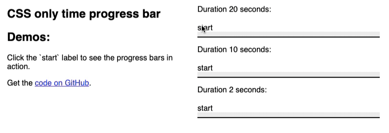

# CSS only time progress bar

For our weekly [WeAreDevelopers Live Show](https://www.wearedevelopers.com/en/live) I wanted to have a way to include a time progess bar into the [page we show](https://devrel.wearedevelopers.com/live/2025-08-27.html). The problem there was that these are markdown files using GitHub Pages and whilst I do use some scripting in them, I wanted to make sure that I could have this functionality in pure CSS so that it can be used on GitHub without having to create an html template. And here we are. 

You can check out the [demo page to see the effect in action](test.html) with the liquid source code or play with the few lines of CSS in [this codepen](https://codepen.io/codepo8/pen/raOogYe). Fork this repo to use it in your pages or just copy the `_includes` folder.

## Using the CSS time progress bar 

You can use as many bars as you want to in a single page. The syntax to include a bar is the following: 

{​% include cssbar.html duration="2s" id="guesttopic" styleblock="yes" %​}

* The `duration` variable defines how long the progress should take
* The `id` variable is necessary to and has to be unique to make the functionality work
* If the `styleblock` is set, the include will add a `style` with the necessary [css rules](css-progress-bar.css) so you don't have to add them to the main site styles. You only need to do that in one of the includes. 

## Drawbacks

* This is a bit of a hack as it is not accessible to non-visual users and abuses checkboxes to keep it CSS only. It is keyboard accessible though. 
* In a better world, I'd have used an HTML `progress` element and styled that one…

## TODO / Feature ideas

* dark/light mode 
* changing label messages over time
* Add warning sound at the end